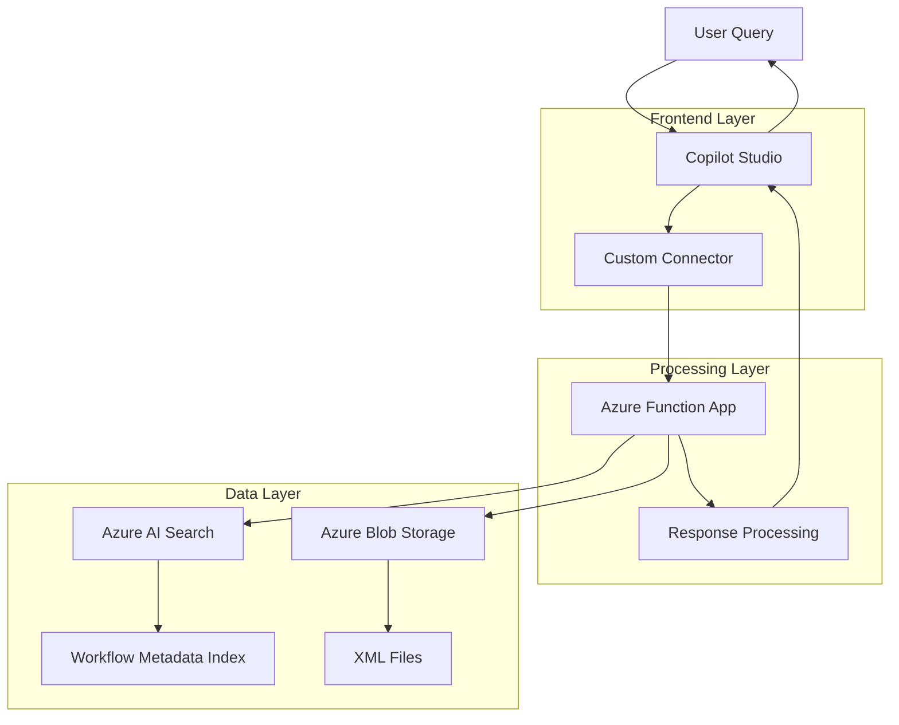
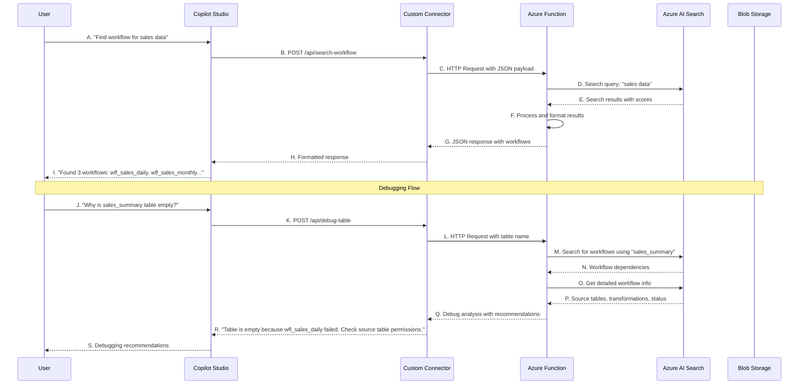

# Informatica Agent Architecture - Detailed Sequence Steps

## High-Level Architecture with Sequence Steps

## Detailed Sequence Steps and Explanations

### Step A: User Query
**What it is**: The starting point where a user (data engineer, analyst, or business user) submits a natural language query about Informatica workflows.

**Examples**:
- "Find workflow for sales data"
- "Why is sales_summary table empty?"
- "Show me all workflows that use customer table"
- "What are the dependencies for wfl_daily_sales?"

**Technical Details**:
- Input can be text, voice, or structured query
- Supports natural language processing
- Handles various query types (search, debug, dependency analysis)

### Step B: Copilot Studio
**What it is**: Microsoft's low-code chatbot platform that provides the conversational interface and handles user interactions.

**Key Functions**:
- Natural language understanding (NLU)
- Intent recognition and classification
- Conversation flow management
- Response formatting and presentation
- Integration with Microsoft 365 ecosystem

**Technical Details**:
- Built on Microsoft Bot Framework
- Supports multiple channels (Teams, web, mobile)
- Handles authentication and user context
- Manages conversation state and history

### Step C: Custom Connector
**What it is**: A bridge component that translates Copilot Studio requests into HTTP calls to Azure Functions and formats responses back to the chatbot.

**Key Functions**:
- API translation and protocol conversion
- Request/response transformation
- Error handling and retry logic
- Authentication and authorization
- Rate limiting and throttling

**Technical Details**:
- RESTful API connector
- Supports JSON payloads
- Handles HTTP status codes and errors
- Implements circuit breaker pattern
- Manages API keys and secrets

### Step D: Azure Function App
**What it is**: The core processing engine that handles business logic, data processing, and orchestrates interactions with data services.

**Key Functions**:
- Workflow search and retrieval
- XML parsing and data extraction
- Business logic implementation
- Error handling and validation
- Response formatting

**Technical Details**:
- Python 3.11 runtime
- HTTP triggers for API endpoints
- Serverless compute model
- Automatic scaling based on demand
- Integration with Azure services

### Step E: Azure AI Search
**What it is**: A cloud search service that provides intelligent search capabilities over the workflow metadata index.

**Key Functions**:
- Semantic search and ranking
- Full-text search across metadata
- Faceted search and filtering
- Relevance scoring
- Search analytics and insights

**Technical Details**:
- Lucene-based search engine
- Supports complex queries and filters
- Real-time indexing capabilities
- RESTful API interface
- Built-in analytics and monitoring

### Step F: Azure Blob Storage
**What it is**: Cloud storage service that holds the original Informatica XML files and processed data.

**Key Functions**:
- XML file repository
- Data backup and archival
- Version control for metadata
- Bulk data operations
- Integration with other Azure services

**Technical Details**:
- Hierarchical namespace support
- Hot, cool, and archive tiers
- REST API and SDK access
- Encryption at rest and in transit
- Global replication options

### Step G: Workflow Metadata Index
**What it is**: A structured search index containing processed workflow information extracted from XML files.

**Key Functions**:
- Fast search and retrieval
- Structured data storage
- Relationship mapping
- Metadata enrichment
- Query optimization

**Technical Details**:
- JSON document format
- Indexed fields for fast search
- Full-text search capabilities
- Faceted search support
- Real-time updates

### Step H: XML Files
**What it is**: The original Informatica PowerCenter XML metadata files containing workflow definitions, mappings, and session information.

**Key Functions**:
- Source of truth for workflow data
- Complete workflow definitions
- Dependency information
- Configuration details
- Historical data preservation

**Technical Details**:
- XML format with Informatica schema
- Contains workflow, mapping, and session data
- Hierarchical structure with relationships
- Large file sizes (10-50MB each)
- Regular updates from Informatica

### Step I: Response Processing
**What it is**: The final processing step that formats search results and prepares the response for the user.

**Key Functions**:
- Result formatting and ranking
- Data validation and verification
- Error handling and fallback
- Response optimization
- User experience enhancement

**Technical Details**:
- JSON response formatting
- Data validation against source XML
- Confidence scoring
- Error message generation
- Response caching

## Detailed System Flow with Sequence Steps

## Step-by-Step Process Flow

### Search Workflow Process (Steps A-I)

**Step A: User Query**
- User types: "Find workflow for sales data"
- Copilot Studio receives the natural language input
- NLU processes the intent and extracts key terms

**Step B: Copilot Studio Processing**
- Intent classification: "search_workflow"
- Entity extraction: "sales data"
- Query formatting for API call

**Step C: Custom Connector Translation**
- Converts Copilot request to HTTP POST
- Adds authentication headers
- Formats JSON payload: `{"workflow_name": "sales data", "max_results": 50}`

**Step D: Azure Function Execution**
- Receives HTTP request at `/api/search-workflow`
- Validates input parameters
- Prepares search query for Azure AI Search

**Step E: Azure AI Search Query**
- Executes semantic search across workflow metadata
- Applies relevance scoring
- Returns ranked results with confidence scores

**Step F: Result Processing**
- Formats search results into structured response
- Adds metadata and descriptions
- Applies business logic and validation

**Step G: Response Formatting**
- Creates JSON response with workflow details
- Includes scores, descriptions, and metadata
- Handles error cases and fallbacks

**Step H: Custom Connector Response**
- Transforms JSON response for Copilot Studio
- Handles HTTP status codes
- Manages error responses

**Step I: User Presentation**
- Copilot Studio formats response for user
- Displays workflows in conversational format
- Provides actionable information and next steps

### Debugging Process (Steps J-S)

**Step J: Debug Query**
- User asks: "Why is sales_summary table empty?"
- Copilot Studio identifies debugging intent
- Extracts table name: "sales_summary"

**Step K: Debug API Call**
- Custom connector calls `/api/debug-table`
- Passes table name and context
- Includes user permissions and scope

**Step L: Function Processing**
- Azure Function receives debug request
- Validates table name and permissions
- Prepares multiple search queries

**Step M: Workflow Search**
- Searches for workflows using "sales_summary" as target
- Identifies dependent workflows
- Finds source workflows and transformations

**Step N: Dependency Analysis**
- Retrieves workflow dependency information
- Identifies upstream and downstream processes
- Maps data flow relationships

**Step O: Detailed Workflow Info**
- Gets comprehensive workflow details
- Retrieves execution status and logs
- Analyzes transformation logic

**Step P: Root Cause Analysis**
- Identifies potential failure points
- Analyzes data flow and transformations
- Checks execution history and errors

**Step Q: Debug Response**
- Formats debugging analysis and recommendations
- Includes specific error messages and solutions
- Provides actionable next steps

**Step R: Response Translation**
- Custom connector formats debug response
- Ensures proper error handling
- Manages response size and complexity

**Step S: User Guidance**
- Copilot Studio presents debugging results
- Provides clear explanations and recommendations
- Offers follow-up actions and resources

## Architecture Benefits

### Scalability
- **Serverless Functions**: Auto-scaling based on demand
- **Search Service**: Handles millions of documents
- **Blob Storage**: Unlimited storage capacity
- **CDN Integration**: Global content delivery

### Reliability
- **Circuit Breaker**: Prevents cascade failures
- **Retry Logic**: Handles transient errors
- **Health Checks**: Proactive monitoring
- **Backup Systems**: Data redundancy

### Security
- **Authentication**: Azure Active Directory integration
- **Authorization**: Role-based access control
- **Encryption**: Data at rest and in transit
- **Audit Logging**: Complete activity tracking

### Performance
- **Caching**: Redis for frequent queries
- **Connection Pooling**: Reuse database connections
- **Batch Processing**: Efficient data processing
- **CDN**: Fast content delivery

## Monitoring and Observability

### Key Metrics
- **Response Time**: End-to-end query processing
- **Throughput**: Queries per second
- **Error Rate**: Failed requests percentage
- **User Satisfaction**: Feedback and ratings

### Logging
- **Application Insights**: Comprehensive telemetry
- **Custom Metrics**: Business-specific measurements
- **Error Tracking**: Detailed error analysis
- **Performance Monitoring**: Real-time performance data

### Alerting
- **Threshold Alerts**: Performance degradation
- **Error Alerts**: System failures
- **Capacity Alerts**: Resource utilization
- **Business Alerts**: SLA violations

This architecture provides a robust, scalable, and maintainable solution for enterprise data workflow management, enabling users to quickly discover, understand, and debug complex Informatica workflows through natural language interactions.
